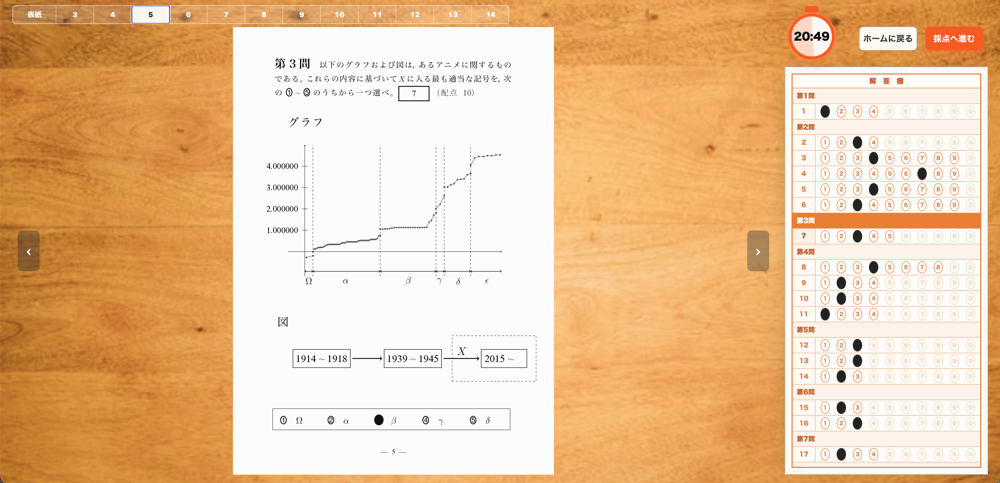
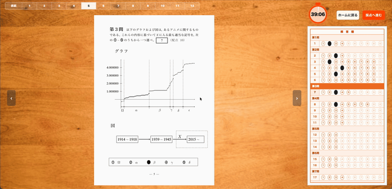
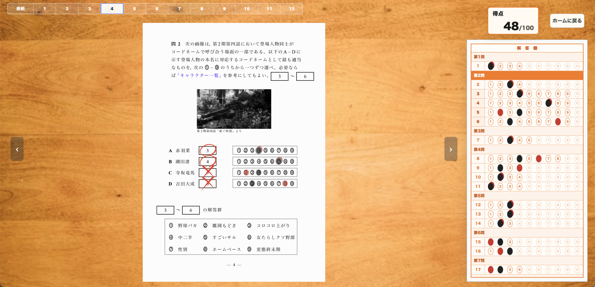

# 共通テスト形式模試 シミュレータ

LaTeXで作成したマークシート形式の問題を，ブラウザ上で解くことができるシミュレータ．作成した問題は[こちら](https://github.com/shihu-14/anime-kyotsutest)．

問題を解答する機能，自動採点機能，正答と自分の解答との差分を確認できる復習機能がある．

## デモ

**[ブラウザでプレイ](https://shihu-14.github.io/kyotsutest-sim/)**

## 主な機能

### 解答機能

<!--  -->


（GIFが表示されない場合は[こちら](docs/movie/solve.mp4)）

表紙の注意事項を確認し試験を開始すると，上記の試験画面に遷移する．解答は，右のマークシートと中央の問題冊子のマーク欄のどちらからでも入力でき，選択した解答は両方へ反映される．
問題冊子の左右にあるボタンや上部のバーなどからページを切り替えることができる．

### 採点機能


（GIFが表示されない場合は[こちら](docs/movie/scoring.mp4)）

試験を終了するか制限時間になると採点画面へ進む．採点画面では，冊子のページを順番にめくりながら各問題に対して⭕️・❌を付ける採点アニメーションが走る．

### 復習機能



採点が終わったら，自分の解答(黒)と正答(赤)を比較して確認できる復習画面に遷移する．

## ファイル構成

```text
.
├── src/
│   ├── app/                 # 画面遷移と試験中の状態管理
│   │                        # （現在見ているページ，解答状況，制限時間など）
│   ├── domain/              # 設問・解答・採点結果を扱うための型定義
│   ├── features/
│   │   ├── home/            # ホーム画面を構成するUI
│   │   │   └── drawing/     # Canvasへの描画入力
│   │   └── exam/            # 試験画面を構成するUI
│   │                        # （表紙，問題冊子，マークシート，タイマー，採点・復習画面など）
│   ├── data/exams/          # 各試験に関するデータ
│   │                        # （設問，正答，配点，マーク欄の位置など）
│   ├── assets/              # アプリ全体で使用する画像などの素材
│   ├── styles/              # アプリ全体で適用するCSS
│   ├── test/                # テスト環境の共通設定と，動作確認用の試験データ
│   └── main.tsx             # Reactアプリを起動し，Appを画面に表示する処理
├── resources/exams/         # 問題ページ画像の生成元となるTeX・PDFファイル
├── .github/workflows/       # GitHub ActionsのCI設定
├── eslint.config.js         # ESLintの設定
├── vite.config.ts           # Vite・Vitestの設定
└── package.json             # 依存パッケージとnpmスクリプトの設定
```

## 使用技術

- フロントエンド：React，TypeScript
- ビルド・開発環境：Vite
- テスト：Vitest，Testing Library
- 静的解析・フォーマット：ESLint，Prettier
- CI：GitHub Actions

## 起動方法

Node.js 22.13.0以降を使用する．GitHub Actionsでも同様のバージョンで検証している．

依存パッケージをインストールする．

```bash
npm install
```

開発サーバーを起動する．

```bash
npm run dev
```

ターミナルに表示されたURLをブラウザで開く．

## 検証

ローカルだけでなく，GitHub ActionsでもPRおよびmainへのpush時に以下の一括検証を実行する．

型チェック，lint，format check，テスト，ビルドをまとめて実行する．

```bash
npm run check
```

個別には以下のコマンドを使用できる．

```bash
npm run typecheck
npm run lint
npm run format:check
npm test
npm run build
npm run test:coverage
```

## 今後の実装予定の機能

- 作問エディタ機能の実装
